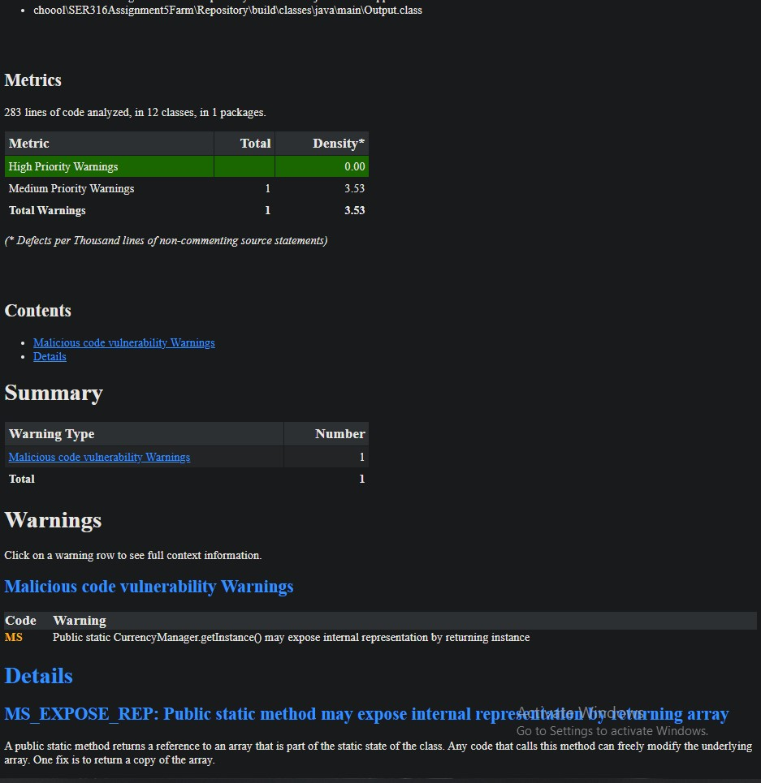

Author: Alper Ozturk

GitHub Repo Link:
https://github.com/aozturk1/SER316Assignment5Farm

Screencast Link:
...

## Description
A simple farming simulation with multiple design patterns implemented. This is an automated program that simulates a farm
with text/command-line outputs.

## Design Patterns
3 design patterns from the Gang of Four:

a) Design Pattern: Factory
Requirement:
    "Farms can be of different types, such as an animal farm, a crop farm, a hybrid farm and so on.
    You can choose to make something up too." 
Implementation: 
    I used a factory generation to generate the specific types of farms such as Animal and Crop farms.

b) Design Pattern: Observer
Requirement: 
    "The farmers on your farm are quite tech savvy, so when animals or crops die (or
    harvested), an automatic message is sent to their supplier notifying them that they
    need more stock."
Implementation: 
    Made an Observer class that can be extended to different types of Observers. One observer type
    that I made was the supplier. The supplies would have a notify message that would be printed out
    if the farm went below a specific animal or crop number.

c) Design Pattern: Singleton
Requirement:
    "Passive currency is earned with each new day (not night). This passive currency
    income is generated from selling crops or animal products, or both depending on
    your farm"
Implementation:
    In order to manage the passive currency and all other money related things, I decided to use
    a singleton CurrencyManager class. This class will deal with losing and getting money and can
    only be had one of because the game is based around one farm manager that manges everything in this
    world.

## How to run the program
### Terminal
Please use the following commands:
```
    Run, "gradle run --console=plain"
```

## Requirements that I think I fulfilled
-Git workflow

-All Design Patterns

-Checkstyle and Spotbugs included

-GitHub Action setup and passes

-JUNIT included and SimulationTest runs and passes

-Readme and PDF as asked

-Gradle works correctly

-Screencast

-And the following game requirements:

• A new world must start with at least 1 farm.
• Farms can be of different types, such as an animal farm, a crop farm, a hybrid farm and so on. You can choose to make something up too.
• The simulation should run on cycles. A cycle is considered to be of 2 parts - 1 day
time and 1 night time.
• Passive currency is earned with each new day (not night). This passive currency
income is generated from selling crops or animal products, or both depending on
your farm.
• Farms are automatically upgraded once the farm has acquired enough currency. This could mean that the farm is expanded to grant it more land, which allows it to hold greater numbers of farmers, animals, and crops. The upgrade may also increase the passive currency income. In order for the simulation to not run into issues, it might be a nice idea to make sure the farm only upgrades once your farm has acquired 20% (choose any % you like though) more than the cost of an upgrade. So, if an upgrade costs $1000, it will automatically upgrade at $1200 so the farm still has $200.
• Animals reside on farms; it is up to you to decide the total number of animals that
your farm(s) will hold. Think of typical farm animals such a cows and pigs, but you
can be creative if you wish.
• Animals have a chance to be born every 4 cycles (must have at least 2 for the chance to occur). Alternatively, as an example, you could specify in your simulation that you wish to spend a certain percentage of your total currency every X number of cycles to buy more animals.
• Crops are grown on farms and have a chance to become diseased. When this happens
they have a chance to wither and die within the next cycle (day and night), unless
treated by a farmer. Crop affinities may help with fighting the disease.
• Crops may be harvested 1 time every 3 cycles.
• The farmers on your farm are quite tech savvy, so when animals or crops die (or
harvested), an automatic message is sent to their supplier notifying them that they
need more stock.

## Screenshots
Gradle build


Gradle run


CheckStyle


Also CheckStyle


SpotBug
Explanation to 1 bug:
MS was complaining about my CurrencyManager class/method which was a singelton so it has
an instantiation with synchronized as well as only way to call it which gets denied if there
is already one of it. To fix this, I had to change the structure of the method/class which 
was unnecessary as synchronization was taking care of the warnings presented below.


CodeCoverage


CodeCoverage


GitHub Actions


Unit Test Screenshot

